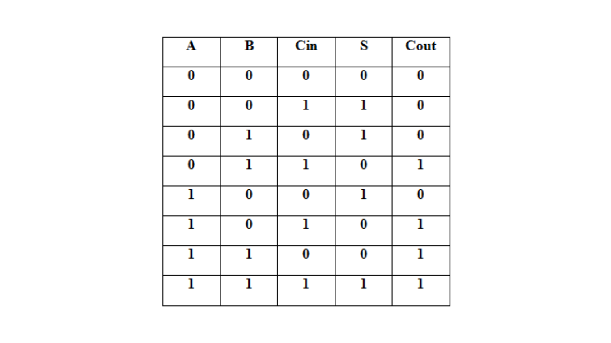
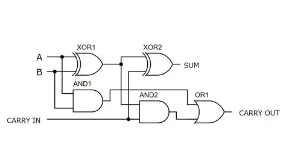
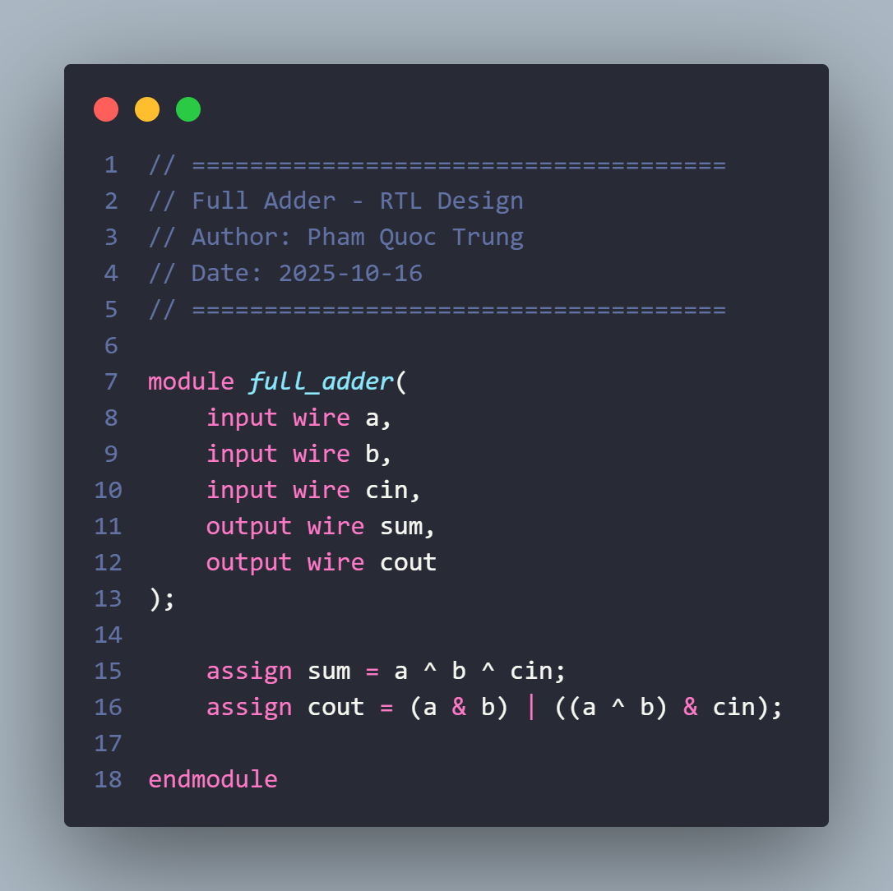
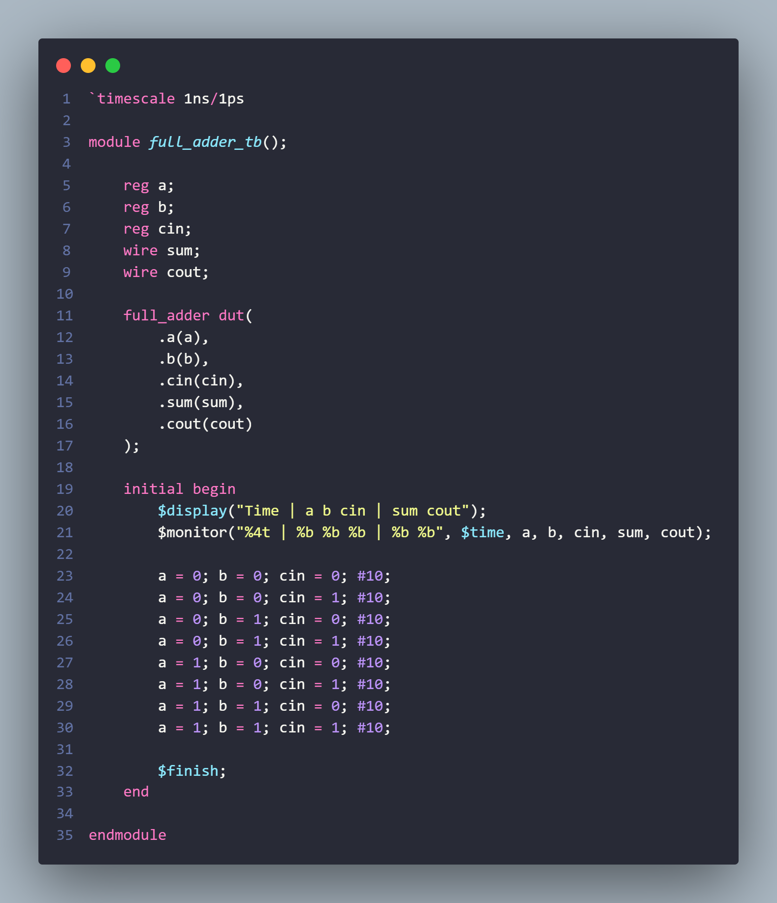
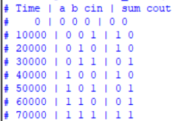
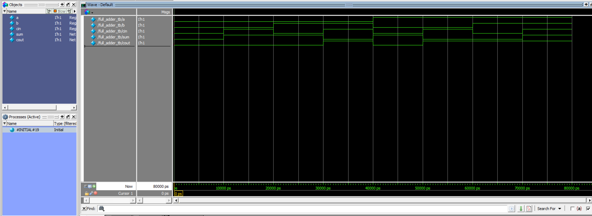
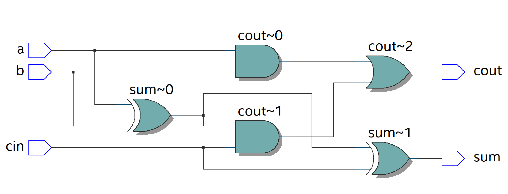
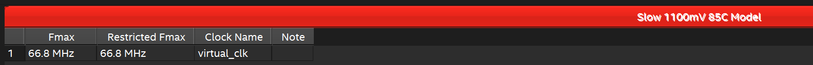
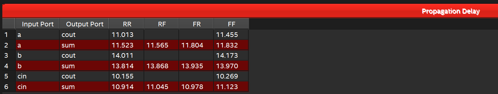

<div align="center">
  <h1>➕ Full Adder RTL Design</h1>
  <p><strong>A complete 1-bit arithmetic cell from truth table to FPGA reports</strong></p>
  <p>
    
    
    
    
  </p>
</div>

---

A 1-bit full adder implemented in synthesizable Verilog and exercised through all eight input combinations. The repository also contains Quartus synthesis, timing and implementation artifacts.

## Design status

| Item | Status |
|---|---|
| RTL | Implemented |
| Exhaustive self-checking testbench | Implemented (8/8 combinations) |
| Quartus project/reports | Included |
| Timing constraints | Included |

## Specification

| Property | Value |
|---|---|
| Design type | Combinational arithmetic |
| Function | `{cout, sum} = a + b + cin` |
| Latency | Combinational; no clock cycles |
| Top module | `full_adder` |

### Interface

| Port | Direction | Width | Description |
|---|---|---:|---|
| `a` | Input | 1 | First operand bit |
| `b` | Input | 1 | Second operand bit |
| `cin` | Input | 1 | Carry input |
| `sum` | Output | 1 | Sum bit |
| `cout` | Output | 1 | Carry output |

### Logic equations

```text
sum  = a XOR b XOR cin
cout = (a AND b) OR ((a XOR b) AND cin)
```





## RTL implementation

The DUT uses two continuous assignments and has no clock, reset, storage element or inferred state.



## Repository structure

```text
.
├── src/full_adder.v
├── sim/
│   ├── full_adder_tb.v
│   └── run.tcl
├── constraints/full_adder.sdc
├── quartus_project/
├── results/sim/
└── images/
```

## Verification

The testbench iterates over `a`, `b` and `cin`, computes the two-bit reference value with `a + b + cin`, and compares it against `{cout, sum}`. All `2 x 2 x 2 = 8` legal binary combinations are covered.

Expected summary:

```text
Total tests: 8 | Passed: 8 | Failed: 0
ALL TESTS PASSED SUCCESSFULLY!
```







### Run with Questa/ModelSim

```bash
vsim -do sim/run.tcl
```

Or:

```tcl
vlib work
vlog src/full_adder.v sim/full_adder_tb.v
vsim -c work.full_adder_tb -do "run -all; quit -f"
```

## Synthesis and timing

The Quartus RTL view should contain the equivalent XOR/AND/OR network.







Timing values are specific to the selected device, constraints and analysis corner. For ASIC reuse, rerun lint, synthesis and STA with the target standard-cell library.
